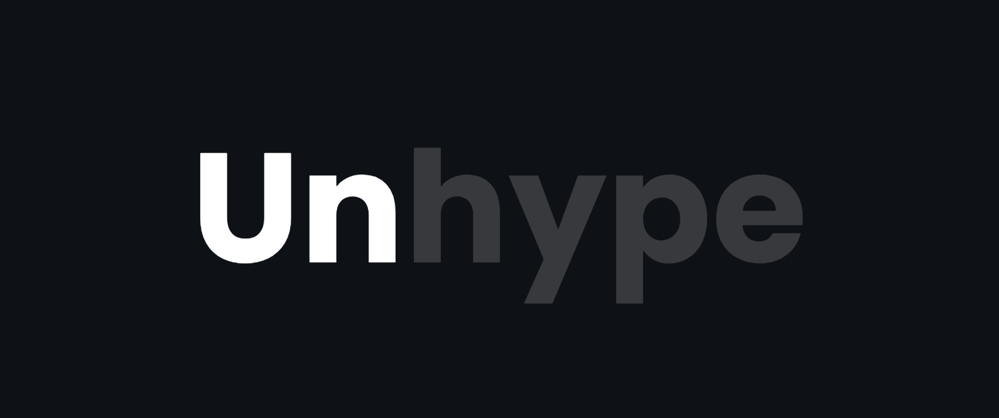
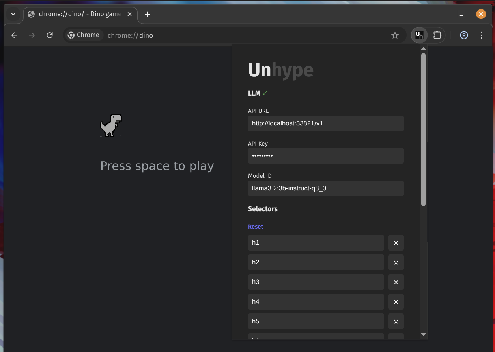
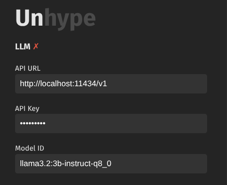
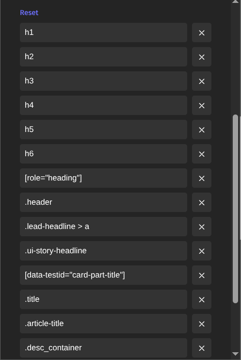

---




---

Browser extension to unhype/neutralise headers on the web.

# Installation

## From extension stores

| Browser | Link |
|---------|------|
| Google Chrome | [Chrome Web Store](https://chromewebstore.google.com/detail/unhype/nmnhedloogpjnfbmkipcolejljminncl?authuser=0&hl=en) |
| Mozilla Firefox | Pending review |
| Microsoft Edge | [Install manually](#microsoft-edge), will submit after they fix login with GitHub |

## Manual

Download a zip archive with the extension for your browser from the [releases page](https://github.com/av/unhype/releases).

### Google Chrome

- Open Chrome and navigate to `chrome://extensions.`
- Enable "Developer mode" using the toggle switch, usually found in the top right corner.
- Click the "Load unpacked" button that appears.
- Select the folder where you extracted the extension files.

### Microsoft Edge

- Open Edge and navigate to `edge://extensions.`
- Enable "Developer mode" using the toggle switch, typically located in the bottom left corner.
- Click the "Load unpacked" button that appears, usually on the main extensions bar.
- Select the folder containing the extracted extension files.

### Mozilla Firefox

- Open Firefox and type about:debugging into the address bar, then press Enter.
- In the left-hand sidebar, click on "This Firefox".
- Click the "Load Temporary Add-on..." button.
- Navigate to the folder where you extracted the extension files and select either the manifest.json file or the ZIP file itself.
- Note: For Firefox, temporary add-ons are removed when you close the browser. For a more permanent installation of a self-developed extension, it typically needs to be signed by Mozilla.

Download from the latest release on [GitHpub](https://github.com/av/unhype/releases)

# Configuration

## Troubleshooting



When configuring the extension, look at the "LLM" indicator, it'll show if the current configuration is valid and if the extension is connected to the LLM. Hover over the indicator to see the reason for the current state.

## Choosing an LLM

Unhype works well with any LLM at or above the Llama 3.2 3B level of performance.

>[!WARNING]
> When using LLMs over paid APIs, it's recommended to choose from cheaper models as the extension could make many requests from specific pages with a lot of headers.

## Configuring unhyped content

You can point the extension to any content on the page, by modifying the list of selectors it operates on.



Default list is configured to work relatively well in most cases, including populr sites like Reddit, Hacker News, Google, and others.

> [!NOTE]
> Extension can be configured to replace entire page content which might lead to unexpected results or excessive LLM usage. Hit "reset" to restore default selectors.

## With Ollama

[Set OLLAMA_ORIGINS](https://github.com/ollama/ollama/blob/main/docs/faq.md#how-do-i-configure-ollama-server) to allow `chrome-extension://*`, `moz-extension://*`

**API URL**<br/>
https://localhost:11434/v1

**API Key**<br/>
Use your Ollama API key, if you have one, otherwise use any random string.

**Model ID**<br/>
Run `ollama ls` to see available models. Follow official guide on downloading new ones.

## With OpenRouter

**API URL**<br/>
https://openrouter.ai/api/v1

**API Key**<br/>
Use existing API key or generate a new one at the [https://openrouter.ai/settings/keys](https://openrouter.ai/settings/keys)

**Model ID**<br/>
Choose from [OpenRouter Models](https://openrouter.ai/models) page

## With Mistral AI

**API URL**<br/>
https://api.mistral.ai/v1

**API Key**<br/>
Use existing Mistral API key or follow the [Quickstart guide on La Plateforme](https://docs.mistral.ai/getting-started/quickstart/)

**Model ID**<br/>
See [Models Overview](https://docs.mistral.ai/getting-started/models/models_overview/) or run `GET /v1/models` to see available models.

## With arbitrary OpenAI-compatible API

Set **API URL**, **API Key** to your OpenAI-compatible API endpoint and key, use one of the models from `GET /v1/models` as **Model ID**.

# Development

```bash
git clone https://github.com/av/unhype.git && cd unhype

bun install
bun run dev
```

